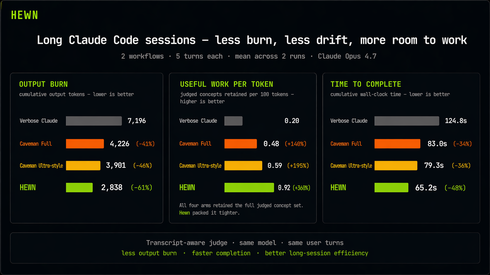

# Hewn

[](https://github.com/tommy29tmar/hewn/actions/workflows/ci.yml)
[](LICENSE)
[](https://github.com/tommy29tmar/hewn/releases)
[](https://claude.com/claude-code)

> **Make Claude Code go longer before limits hit.**
>
> *Less output burn. Less drift. Faster long sessions.*

Claude Code is best when you stay in one session and keep pushing. It
is also where it hurts most: repeated context, long answers, and output
burn exactly when the budget starts to matter.

Hewn is built for that failure mode. It keeps Claude Code tighter over
long sessions by routing each turn into a compact answer shape and then
re-asserting that route every turn, so the model spends less output on
restating context and more on the actual work.

Caveman already showed that compressed prompting helps. Hewn is tuned
for a different bottleneck: long-session efficiency when Claude Code
limits get tight.

Simple rule: if you want the most aggressive compression on one giant
prompt, use Caveman. If you spend hours inside one Claude Code session
and the limits are the pain, use Hewn.

No proxy. No telemetry. Default `claude` untouched.



> This is the proof asset: the multi-turn benchmark where Hewn is
> strongest.
>
> 5-turn workflow, Claude Opus 4.7, same model and prompts across all
> four arms. Concept retention measured by transcript-aware
> LLM-as-judge.
>
> Full methodology, raw snapshots, and per-track evidence:
> [`benchmarks/report/REPORT.md`](benchmarks/report/REPORT.md) ·
> [`benchmarks/RUNBOOK.md`](benchmarks/RUNBOOK.md) for reproduction.

## Install

```bash
curl -fsSL https://raw.githubusercontent.com/tommy29tmar/hewn/main/integrations/claude-code/install.sh | bash
```

## Use

```bash
hewn                     # interactive session with Hewn long-session routing
hewn -p "your prompt"    # non-interactive
```

Any flag accepted by `claude` is forwarded:
`hewn --model claude-opus-4-7 -p "…"`.

The default `claude` command is untouched. Want normal Claude? Just
type `claude`.

## Beyond the headline

- **Built for Claude Code's real bottleneck** — Hewn is not trying to
  make Claude merely sound shorter in isolation. The goal is to reduce
  output burn, latency, and turn-by-turn drift once a real coding
  session gets deep.

- **The drift-fix hook is doing real work** — In multi-turn sessions,
  removing Hewn's classifier hook costs **+4,700 to +5,300 cumulative
  tokens** per 5-turn workflow. The hook earns its keep.
  *Source: T4, `hewn_full` vs `hewn_prompt_only`.*

- **Causal savings vs default Claude** — On Caveman's own short-Q&A
  prompts, Hewn cuts output by a median of **52%** (range 17–92%, best
  case `fix-node-memory-leak` at 92%) compared to unprompted Claude on
  the same model.
  *Source: T1b, 10 prompts × 3 runs per arm.*

- **No ultra-tax on technical literals** — Caveman Ultra-style's
  aggressive compression drops required exact strings
  (`"X-Forwarded-For"`, `"401"`) to 80% preservation; Hewn keeps them
  at **100%**.
  *Source: T1b literal preservation, 15 judgments per arm.*

- **Vibe trade-off is explicit** — On non-tech prompts, Hewn averages
  **63%** concept coverage vs Caveman **78%** while using about **3×
  fewer tokens**. Different design philosophy, visible in the data.
  *Source: T2, 5 prompts × 3 runs per arm.*

→ Full per-prompt breakdown and raw judgments:
[`benchmarks/report/REPORT.md`](benchmarks/report/REPORT.md)

## Where Hewn doesn't win

Honesty matters. The benchmark shows three cases where Hewn is not the
right tool — and one of them is "use Caveman instead":

- **Single-shot long-context tasks (~5k+ token prompts)** — Caveman
  Full beats Hewn on tokens here: 1,224 mean output tokens vs Hewn's
  2,099 across three long-context review/planning prompts, both at
  100% concept coverage. If your bottleneck is one big prompt and you
  want the most aggressive single-shot compression, Caveman is the
  better fit. Hewn's design assumption is that the win compounds across
  *many* turns (T4), not within one giant turn.
  *Source: T3, 3 prompts × 3 runs per arm.*
- **Vibe / non-tech prompts** — Hewn 63% concept coverage vs Caveman 78%.
  Hewn is agent-mode (asks before guessing); Caveman is tutorial-mode
  (enumerates options). Different design philosophy, both valid.
  *Source: T2, 5 prompts × 3 runs per arm.*
- **Expansive prose (release notes, apology emails)** — All arms
  including Hewn produce ~100% concept coverage at near-identical
  token cost (~500 tokens). No advantage either direction; just use
  whatever you have open.
  *Source: T5, 2 prompts × 2 runs per arm.*

## How it works

Hewn wraps `claude` with two pieces:

1. **A thinking-mode system prompt** appended via `--append-system-prompt`,
   which routes each turn to one of six answer shapes (IR, prose+code,
   prose-findings, prose-polished, prose-polished+code, prose-caveman)
   based on task structure.
2. **A per-turn drift-fix hook** registered via `--settings`, which
   classifies every user prompt and re-injects the routing directive as
   `additionalContext`. This prevents the long-session drift you see when
   relying on the system prompt alone.

Technical tasks may route into a tiny IR:

```text
@hewn v0 hybrid
G: goal
C: constraints
P: plan
V: verify
A: action
```

Most users do not need to care. Run `hewn`; Claude Code wastes less
output on the way to the answer.

## Locales

Hewn ships classifier patterns for `en`, `it`, `es`, `fr`, `de`. The
locale is auto-detected from `$LANG` at run time, so non-English shells
just work out of the box. Example: `LANG=it_IT.UTF-8` loads `en + it`
automatically.

Override when needed:

```bash
hewn --locale en,it        # force this stack for one invocation
export HEWN_LOCALE=en,es   # persistent in your shell rc
export HEWN_LOCALE=en      # force English-only
```

Precedence: `--locale` > `HEWN_LOCALE` > `$LANG` auto-detect > English-only.
Details: [integrations/claude-code/README.md](integrations/claude-code/README.md#locales).

## Examples

- [T4 multi-turn benchmark](benchmarks/report/REPORT.md#t4--multi-turn-drift--isolated-hook-value) —
  the primary proof case for Hewn: long sessions under tighter limits.
- [Long-context security review (Atlas API)](examples/atlas-xff-review.md) —
  historical qualitative boundary example; useful for prompt shape, but
  not the main launch claim.

## What gets installed

- `~/.local/bin/hewn`
- `~/.claude/hewn_thinking_system_prompt.txt`
- `~/.claude/hooks/hewn_drift_fixer.py`
- `~/.claude/hooks/locales/{en,it,es,fr,de}.py`

That is it.

## Uninstall

```bash
rm -f ~/.local/bin/hewn \
      ~/.claude/hewn_thinking_system_prompt.txt \
      ~/.claude/hooks/hewn_drift_fixer.py
rm -rf ~/.claude/hooks/locales
```

## Contributing

PRs welcome — especially expanding locale classifier patterns
(`integrations/claude-code/hooks/locales/<code>.py`) with real-prompt
evidence in non-English languages. See [CONTRIBUTING.md](CONTRIBUTING.md).

## License

MIT. See [LICENSE](LICENSE).
