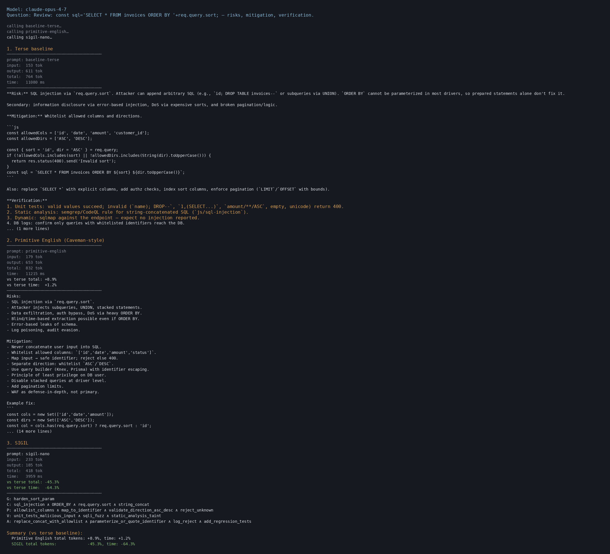

# Flint

**Caveman prompts. Flint delivers.**

On realistic coding workloads — codebases, CLAUDE.md loaded, RAG context — Claude writes answers **4× shorter, 3× faster, covering 9 more concept points** than verbose Claude. And it beats "Caveman prompting" on every column too. Measured on 40 samples (10 long-context tasks × 4 runs) on Opus 4.7 with prompt cache active.

Claude Code Max users: `cccflint` injects Flint thinking-mode at system-prompt level, giving 100% task classification (IR for technical, prose for human) with -22% tokens on mixed workloads. See [Claude Code Max](#claude-code-max-always-on-with-cccflint) below.


## Install

```bash
curl -fsSL https://raw.githubusercontent.com/tommy29tmar/flint/main/integrations/claude-code/install.sh | bash
```

The installer puts four artifacts in place:

1. **Slash skills** (per-turn, opt-in):
   ```
   /flint <question>          one-shot: answer in strict Flint IR
   /flint-on                   turn on strict Flint for this conversation
   /flint-off                  back to normal prose
   /flint-audit <file|paste>   decode a Flint document back to prose
   ```
2. **Output-styles** (per-session, set via `/config`): `flint` (strict IR always) and `flint-thinking` (dual-mode, opt-in via menu).
3. **`cccflint` binary** (Claude Code Max always-on path): see next section.
4. **`flint` Python CLI**: for parsing, validation, audit rendering outside Claude Code.

The default `claude` command is never touched — every Flint path is opt-in.

## Claude Code Max (always-on with cccflint)

`cccflint` is a small wrapper that runs `claude --append-system-prompt "$FLINT_THINKING_PROMPT"`. The `--append-system-prompt` flag is the only Claude Code mechanism that reaches system-prompt level — output-styles, hooks, skills, and CLAUDE.md load as context and cannot fully override Claude Code's built-in system prompt. That's why always-on via output-style alone doesn't trigger the IR compression reliably.

```bash
cccflint                           # interactive session, Flint thinking-mode active
cccflint -p "your prompt here"     # non-interactive
```

Measured on 6 mixed prompts (3 IR-shape: debug, code review, refactor · 3 prose-shape: explanation, brainstorm, RFC), 3 runs per cell, on Claude Opus 4.7 via Claude Max:

| variant          | classification | class_ir | class_prose | mean out tokens | parser-pass (IR) |
|------------------|---------------:|---------:|------------:|----------------:|-----------------:|
| plain `claude`   |            50% |       0% |        100% |             537 |               0% |
| **cccflint**     |       **100%** | **100%** |    **100%** |         **409** |          **89%** |

`cccflint` emits Flint IR for every IR-shape task (0% → 100%), keeps every prose task in Caveman-style prose, cuts mean output tokens by 24%, and the IR it produces passes the strict Flint parser 89% of the time on IR-shape tasks (8 of 9 samples across 3 runs × 3 IR-shape tasks) — above the ~80% parser-pass rate of strict Flint on its own 10-task corpus. Zero marginal cost on the Claude Max plan — no Anthropic API calls.

### Optional: MCP tool enforcement with `cccflint-mcp`

For downstream tooling that needs API-validated parseable IR, `cccflint-mcp` wraps `claude --mcp-config <flint-server>` and instructs the model to call `submit_flint_ir` (a Flint MCP tool with a regex-enforced JSON Schema) instead of emitting free-text IR. The Anthropic API rejects malformed atoms before they reach the tool — when the tool fires, the emitted IR is parseable by construction.

Trade-off: MCP adds ~20% output token overhead (tool round-trip), so `cccflint` remains the default choice for interactive use. Use `cccflint-mcp` when: you pipe Flint output into `flint audit --explain`, CI linters, or analytics that must not fail on malformed grammar.

Multi-turn 4-cell bench (2 scenarios × 4 turns, 3 runs = 24 samples per cell, agent-mode contamination excluded — see failure modes for methodology):

| variant              | class_acc | ir_hit | tool_hit | total_tok | mean_lat |
|----------------------|----------:|-------:|---------:|----------:|---------:|
| plain `claude`       |       25% |     0% |       0% |     34248 |    29.4s |
| **cccflint**         |   **54%** | **29%** |      0% | **27404** | **24.3s** |
| plain + MCP          |       25% |     0% |       0% |     43384 |    34.7s |
| cccflint + MCP       |       46% |    21% |  **21%** |     41304 |    31.6s |

On multi-turn, `cccflint` saves **-20% output tokens and -17% latency** vs plain claude (per-scenario: deep-debug -12.6%, mixed-security -32.7%). Classification accuracy is 2.2× plain claude (54% vs 25%). The multi-turn drift (IR emits at turn 1, drifts to prose on turns 2-4) affects all variants — if per-turn IR is required, open a fresh `cccflint` session per task or use the one-shot `/flint` skill.

`plain + MCP` is the worst outcome: the Flint MCP tool is available but never called without a system-prompt push, so it only adds the MCP tool-catalog tax to every turn. `cccflint + MCP` sits at +51% tokens vs `cccflint` due to tool round-trip overhead; use it when parser-validated IR is required by downstream tooling, otherwise stick with plain `cccflint`.

### Compression scales with context length

The short-prompt corpus above measures the classification floor. A second corpus (`evals/claude_code_max_long_prompts.jsonl`) exercises realistic working-session prompts: 5 tasks of 300–700 input tokens (400-line auth module debug, 200-line security diff review, multi-file refactor plan, full-system architecture walkthrough, open-ended tradeoff discussion). 3 runs:

| corpus              | plain `claude` mean out | cccflint mean out |   savings |
|---------------------|------------------------:|------------------:|----------:|
| short (≤100 tok in) |                 537 tok |           409 tok |      -24% |
| **long (300-700 tok in)** |         **2799 tok** |      **1313 tok** |  **-53%** |

The longer the prompt, the bigger the win. On individual IR-shape tasks the gap widens: `long-debug-auth-module` is 1886 tokens of markdown under plain `claude` versus 402 tokens of structured Flint IR under `cccflint` — **-79% on the same task, same diagnosis, same fix**. Latency drops from 47s to 30s mean (-36%).

Parser-pass on IR outputs: **100% (9/9)** on long IR-shape tasks. Grammar compliance does not degrade with prompt length.

Reproduce:
```bash
RUNS=3 ./scripts/bench_claude_code_max.sh      # short corpus (6 prompts)
RUNS=3 ./scripts/bench_claude_code_max_long.sh # long corpus (5 prompts)
python3 scripts/claude_code_max_table.py
python3 scripts/claude_code_max_long_table.py
```

## Why it works

Most token-saving tricks save tokens by telling Claude to drop words. That works until Claude also drops the concepts you needed.

Flint doesn't compress the words. It compresses the **shape** of the answer into 5 slots:

- **G** — the goal
- **C** — the context and constraints
- **P** — the plan
- **V** — how to verify it
- **A** — the action to take

One operator, `∧`. Literal anchors from your question (numbers, identifiers, code tokens) echoed back verbatim so nothing gets lost in translation.

That's it. Six lines. Same concepts. Fewer tokens. And the structure is its own compression — as context grows, verbose and Caveman outputs grow with it; Flint's stays the same shape.

## Proof

Benchmark on Claude Opus 4.7, **10 realistic long-context coding tasks** (debug, architecture, security review, refactor, N+1, memory leaks, webhook idempotency, rate-limit audit, library extraction, audit-log schema) with ~10k tokens of project-handbook context loaded per call — the shape of a real Claude Code / RAG / agent session with prompt cache active. **4 runs per cell, 40 samples per cell**.

| approach                      | output tokens | latency | concepts covered |
|-------------------------------|--------------:|--------:|-----------------:|
| Claude default (verbose)      |       736 ±28 |  15s ±1 |           86% ±1 |
| Caveman ("primitive English") |       423 ±18 |   9s ±0 |           84% ±4 |
| **Flint**                     |   **186 ±10** | **5s ±0** |     **95% ±4** |

Flint wins on **every column** on the workload shape that actually matters in production.

- vs verbose Claude: **-75% output tokens, -65% latency, +9pt concept coverage**
- vs Caveman: **-56% output tokens, -44% latency, +11pt concept coverage**

Concept coverage is measured against must-cover keywords picked from each task's intent, using stems that tolerate Flint's symbolic compression (e.g. `idempot` matches both `idempotent` and `idempotency`; `semver` matches both the word and `semver("1.0.0")`). Without that calibration, any structural format would look worse than prose on its own surface vocabulary — which is a measurement artifact, not a real gap.

## Before / after

Real output from the benchmark. Task: *"review this rate-limiter diff for a bypass vulnerability."* Same model, same context, same question.



Same bug, same fix, same verification plan, same risk flags. A third of the tokens, no prose filler, and the `[AUDIT]` block still reads as natural language — no mental parsing required.

## Flint vs Caveman

"Caveman prompting" tells Claude to drop articles and filler. On short Q&A it saves tokens. But on real work — multi-file diffs, codebase review, long agent loops — Caveman has no ceiling on its output. It keeps rambling in "primitive English" and ends up ~40% shorter than verbose Claude while covering slightly fewer concepts (84% vs 86%).

Flint replaces the "no articles" discipline with a **structural** one: five slots (Goal, Constraints, Plan, Verify, Action), atoms joined by `∧`. The structure is its own compression. Give Flint more context and it stays 6 lines. Give Caveman more context and it writes more cave.

## When things drift

Claude sometimes drifts off format. Flint ships with a parser, a repair layer, and `flint audit --explain` that shows you exactly what came in, what was repaired, which anchors matched, and a prose rerender — so you can trust the output even on the worst cases.

```bash
flint audit --explain response.flint --anchor 300 --anchor 401
```

## More CLI tools

```bash
# Per-file CLAUDE.md audit — structurally-safe compression preview (read-only)
flint claude-code inventory path/to/CLAUDE.md
flint claude-code diff path/to/CLAUDE.md
```

See [integrations/claude-code/README.md](integrations/claude-code/README.md) for the full list of preserved segment types and caching behavior.

## Reproduce the numbers

```bash
git clone https://github.com/tommy29tmar/flint && cd flint
cp .env.example .env && $EDITOR .env      # ANTHROPIC_API_KEY
RUNS=4 ./scripts/run_stress_bench.sh       # 10 tasks × 4 runs, ~5 min
python3 scripts/stress_table.py
```

Default `RUNS=2` for a quick check; `RUNS=4` matches the numbers above.

## Honest scope

Flint shines on crisp technical asks: debug this, review this diff, refactor this function, sketch this architecture. It's not for open-ended writing. Use Claude normally for that.

## Dig deeper

- [docs/methodology.md](docs/methodology.md) — how the stress bench works, what concept coverage actually measures, what we don't claim.
- [docs/architecture.md](docs/architecture.md) — the IR, the parser, the repair layer, the audit pipeline, and what the shipped artifact is.
- [docs/failure_modes.md](docs/failure_modes.md) — where Flint breaks, drift patterns, and when to disable it.
- [FLINT_GRAMMAR.ebnf](FLINT_GRAMMAR.ebnf) — the formal grammar.

## License

MIT. If you cite Flint in research, see [CITATION.cff](CITATION.cff).
